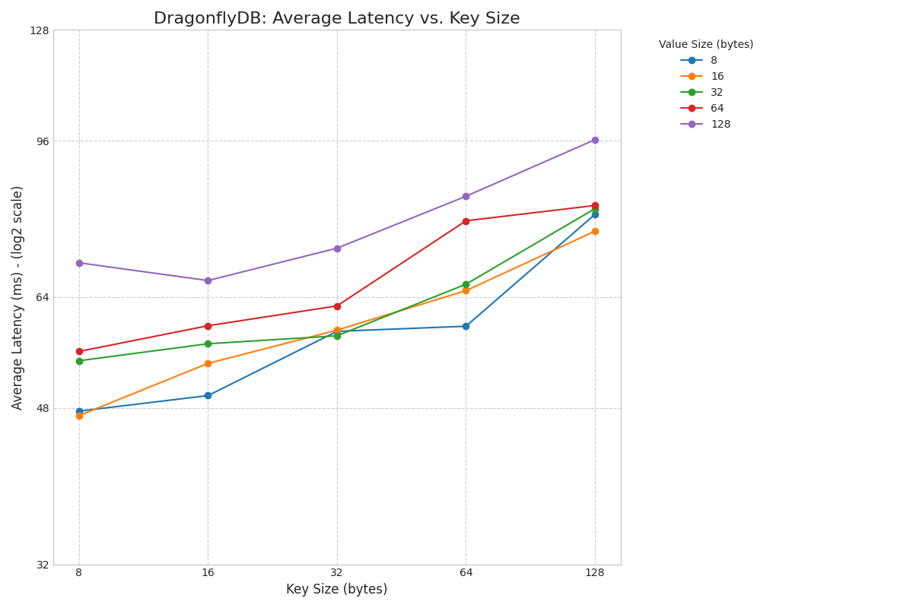
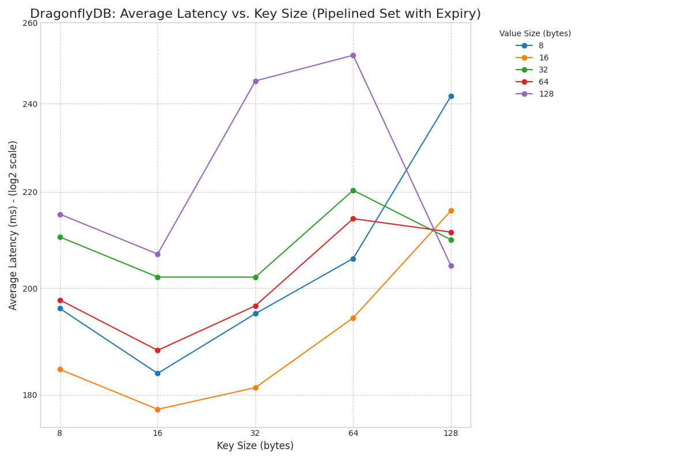

# Dragonfly

## Build image for the benchmark

```console
APP_VERSION=$(cargo pkgid --manifest-path Cargo.toml | cut -d '#' -f2); docker build --platform linux/amd64 \
    --build-arg BUILD_DATE="$(date +'%Y-%m-%dT%H:%M:%S%z')" \
    --build-arg COMMIT_SHA=$(git rev-parse HEAD) \
    --build-arg VERSION=$(cargo pkgid --manifest-path Cargo.toml | cut -d '#' -f2) \
    . -f docker/dev.dockerfile \
   -t dragonfly-playground-rs-dev:$APP_VERSION
```

## Run the benchmark

Choose one of the benchmarks: write_throughput, payload_latency, pipeline_builder

## The benchmarking environment

Bare-metal machine:
- CPU: 2 x AMD EPYC 7643 48-Core Processor, 192 vCPU in total
- RAM: 1536 GiB
- OS: Ubuntu 22.04.5 LTS, 5.15.0-153-generic, x86_64

### End-to-End Benchmarks: Write Throughput

```console
docker run -it --network=host \
    --env HTTP_PROXY="${http_proxy}" \
    --env HTTPS_PROXY="${https_proxy}" \
    --env NO_PROXY="${no_proxy}" \
    dragonfly-playground-rs-dev:0.1.0 \
    -c "REDIS_BENCH_SERVER=127.0.0.1:6379 REDIS_BENCH_MULTI_SET=1 cargo bench --bench write_throughput"
```

#### Throughput when batch_size = 10000 AND write_connection_pool_size = 100

##### multi_set

| Benchmark                 | Time (ms)       | Avg Time (ms) | Throughput (elem/s)      | Avg Throughput (elem/s) | Throughput (MiB/s)    | Avg Throughput (MiB/s) |
|:--------------------------|:----------------|:--------------|:-------------------------|:------------------------|:----------------------|:-----------------------|
| AsyncRedisClientV1        | 70.529 – 70.867 | 70.664        | 1.4111 – 1.4179 M elem/s | 1.4152 M elem/s         | 134.57 – 135.22 MiB/s | 134.96 MiB/s           |
| AsyncRedisClientPooled x1 | 59.032 – 59.545 | 59.273        | 1.6794 – 1.6940 M elem/s | 1.6871 M elem/s         | 160.16 – 161.55 MiB/s | 160.89 MiB/s           |
| AsyncRedisClientPooled x2 | 30.298 – 30.543 | 30.416        | 3.2740 – 3.3006 M elem/s | 3.2878 M elem/s         | 312.24 – 314.78 MiB/s | 313.56 MiB/s           |
| AsyncRedisClientPooled x4 | 22.129 – 22.248 | 22.187        | 4.4949 – 4.5190 M elem/s | 4.5072 M elem/s         | 428.67 – 430.97 MiB/s | 429.84 MiB/s           |
| AsyncRedisClientPooled x8 | 16.797 – 16.882 | 16.838        | 5.9236 – 5.9534 M elem/s | 5.9390 M elem/s         | 564.92 – 567.76 MiB/s | 566.39 MiB/s           |

##### pipelined_set_with_expiry_manual

| Benchmark                 | Time (ms)       | Avg Time (ms) | Throughput (elem/s)      | Avg Throughput (elem/s) | Throughput (MiB/s)    | Avg Throughput (MiB/s) |
|:--------------------------|:----------------|:--------------|:-------------------------|:------------------------|:----------------------|:-----------------------|
| AsyncRedisClientV1        | 163.46 – 163.95 | 163.70        | 609.95 – 611.77 K elem/s | 610.88 K elem/s         | 58.17 – 58.34 MiB/s   | 58.25 MiB/s            |
| AsyncRedisClientPooled x1 | 176.34 – 179.07 | 177.65        | 558.44 – 567.07 K elem/s | 562.92 K elem/s         | 53.26 – 54.08 MiB/s   | 53.69 MiB/s            |
| AsyncRedisClientPooled x2 | 93.510 – 94.006 | 93.751        | 1.0638 – 1.0694 M elem/s | 1.0667 M elem/s         | 101.45 – 101.98 MiB/s | 101.73 MiB/s           |
| AsyncRedisClientPooled x4 | 68.057 – 68.447 | 68.250        | 1.4610 – 1.4694 M elem/s | 1.4652 M elem/s         | 139.33 – 140.13 MiB/s | 139.73 MiB/s           |
| AsyncRedisClientPooled x8 | 54.787 – 55.190 | 54.981        | 1.8119 – 1.8252 M elem/s | 1.8188 M elem/s         | 172.79 – 174.06 MiB/s | 173.45 MiB/s           |

#### Throughput when batch_size = 1000 AND write_connection_pool_size = 100

##### multi_set

| Benchmark                 | Time (ms)       | Avg Time (ms) | Throughput (elem/s)      | Avg Throughput (elem/s) | Throughput (MiB/s)  | Avg Throughput (MiB/s) |
|:--------------------------|:----------------|:--------------|:-------------------------|:------------------------|:--------------------|:-----------------------|
| AsyncRedisClientV1        | 78.317 – 78.828 | 78.589        | 1.2686 – 1.2769 M elem/s | 1.2724 M elem/s         | 121.0 – 121.8 MiB/s | 121.3 MiB/s            |
| AsyncRedisClientPooled x1 | 87.272 – 87.694 | 87.462        | 1.1403 – 1.1458 M elem/s | 1.1433 M elem/s         | 108.7 – 109.3 MiB/s | 109.0 MiB/s            |
| AsyncRedisClientPooled x2 | 51.311 – 51.551 | 51.424        | 1.9398 – 1.9489 M elem/s | 1.9446 M elem/s         | 185.0 – 185.9 MiB/s | 185.5 MiB/s            |
| AsyncRedisClientPooled x4 | 30.553 – 30.664 | 30.607        | 3.2611 – 3.2730 M elem/s | 3.2672 M elem/s         | 311.0 – 312.1 MiB/s | 311.6 MiB/s            |
| AsyncRedisClientPooled x8 | 18.735 – 18.800 | 18.766        | 5.3192 – 5.3376 M elem/s | 5.3287 M elem/s         | 507.3 – 509.0 MiB/s | 508.2 MiB/s            |

##### pipelined_set_with_expiry_manual

| Benchmark                 | Time (ms)       | Avg Time (ms) | Throughput (elem/s)      | Avg Throughput (elem/s) | Throughput (MiB/s)  | Avg Throughput (MiB/s) |
|:--------------------------|:----------------|:--------------|:-------------------------|:------------------------|:--------------------|:-----------------------|
| AsyncRedisClientV1        | 197.09 – 199.08 | 198.15        | 502.31 – 507.38 K elem/s | 504.66 K elem/s         | 47.9 – 48.4 MiB/s   | 48.1 MiB/s             |
| AsyncRedisClientPooled x1 | 209.17 – 210.31 | 209.71        | 475.49 – 478.07 K elem/s | 476.84 K elem/s         | 45.3 – 45.6 MiB/s   | 45.5 MiB/s             |
| AsyncRedisClientPooled x2 | 128.66 – 129.52 | 129.07        | 772.07 – 777.24 K elem/s | 774.78 K elem/s         | 73.6 – 74.1 MiB/s   | 73.9 MiB/s             |
| AsyncRedisClientPooled x4 | 77.677 – 78.644 | 78.176        | 1.2716 – 1.2874 M elem/s | 1.2792 M elem/s         | 121.3 – 122.8 MiB/s | 122.0 MiB/s            |
| AsyncRedisClientPooled x8 | 55.084 – 55.698 | 55.417        | 1.7954 – 1.8154 M elem/s | 1.8045 M elem/s         | 171.2 – 173.1 MiB/s | 172.1 MiB/s            |

### Different key and value sizes

##### multi_set

| Key Size (bytes) | Value Size (bytes) | Average Latency (ms) | Latency Range (ms) | Average Throughput (Melem/s) | Throughput Range (Melem/s) |
|:-----------------|:-------------------|:---------------------|:-------------------|:-----------------------------|:---------------------------|
| 8                | 8                  | 47.616               | 47.343 - 47.855    | 2.1001                       | 2.0897 - 2.1122            |
| 8                | 16                 | 47.068               | 47.013 - 47.124    | 2.1246                       | 2.1221 - 2.1271            |
| 8                | 32                 | 54.266               | 54.199 - 54.334    | 1.8428                       | 1.8405 - 1.8450            |
| 8                | 64                 | 55.587               | 55.309 - 55.922    | 1.7990                       | 1.7882 - 1.8080            |
| 8                | 128                | 69.961               | 69.824 - 70.101    | 1.4294                       | 1.4265 - 1.4322            |
| 16               | 8                  | 49.577               | 49.490 - 49.684    | 2.0171                       | 2.0127 - 2.0206            |
| 16               | 16                 | 53.891               | 53.515 - 54.283    | 1.8556                       | 1.8422 - 1.8687            |
| 16               | 32                 | 56.710               | 56.607 - 56.858    | 1.7633                       | 1.7588 - 1.7666            |
| 16               | 64                 | 59.424               | 59.375 - 59.473    | 1.6828                       | 1.6814 - 1.6842            |
| 16               | 128                | 66.814               | 66.474 - 67.124    | 1.4967                       | 1.4898 - 1.5043            |
| 32               | 8                  | 58.565               | 58.432 - 58.728    | 1.7075                       | 1.7028 - 1.7114            |
| 32               | 16                 | 58.749               | 58.598 - 58.934    | 1.7022                       | 1.6968 - 1.7065            |
| 32               | 32                 | 57.892               | 57.477 - 58.288    | 1.7273                       | 1.7156 - 1.7398            |
| 32               | 64                 | 62.559               | 61.423 - 63.697    | 1.5985                       | 1.5699 - 1.6281            |
| 32               | 128                | 72.665               | 72.113 - 73.238    | 1.3762                       | 1.3654 - 1.3867            |
| 64               | 8                  | 59.350               | 59.182 - 59.537    | 1.6849                       | 1.6796 - 1.6897            |
| 64               | 16                 | 65.088               | 64.904 - 65.321    | 1.5364                       | 1.5309 - 1.5407            |
| 64               | 32                 | 66.184               | 65.960 - 66.488    | 1.5109                       | 1.5040 - 1.5161            |
| 64               | 64                 | 78.014               | 77.675 - 78.356    | 1.2818                       | 1.2762 - 1.2874            |
| 64               | 128                | 83.142               | 82.651 - 83.683    | 1.2028                       | 1.1950 - 1.2099            |
| 128              | 8                  | 79.325               | 79.176 - 79.462    | 1.2606                       | 1.2585 - 1.2630            |
| 128              | 16                 | 75.934               | 75.659 - 76.202    | 1.3169                       | 1.3123 - 1.3217            |
| 128              | 32                 | 80.514               | 80.315 - 80.793    | 1.2420                       | 1.2377 - 1.2451            |
| 128              | 64                 | 81.177               | 80.799 - 81.609    | 1.2319                       | 1.2254 - 1.2376            |
| 128              | 128                | 96.283               | 95.623 - 96.999    | 1.0386                       | 1.0309 - 1.0458            |



#### Key Practical Lessons from the Benchmark

##### 1. **Payload Size is the #1 Factor in Performance**

The most obvious and impactful lesson is that the total size of your keys and values directly dictates performance.

* **Observation**: As either the key size or the value size increases, latency consistently rises, and throughput drops.
  The fastest operation (Key: 8B, Value: 16B) was over **2x faster** than the slowest (Key: 128B, Value: 128B).
* **Practical Lesson**: **Be ruthless about minimizing data size.** Before storing data, ask yourself:
    * Can I use a shorter key (e.g., a numeric ID instead of a long string or hashing the key for long keys)?
    * Can I trim unnecessary data from the value?
    * Can I use a more compact serialization format (like MessagePack, Protobuf, FlatBuffers instead of JSON)?
      Every byte you save will directly translate to lower latency and higher throughput.

##### 2. **Key Size Can Be More impactful Than Value Size**

While both matter, the impact of increasing key size is particularly significant, especially as the keys get longer.

* **Observation**: Increasing the key size from 8 to 128 bytes (with an 8-byte value) increased latency by **~67%** (
  from 47.6 ms to 79.3 ms). In contrast, increasing the value size from 8 to 128 bytes (with an 8-byte key) increased
  latency by **~47%** (from 47.6 ms to 69.9 ms).
* **Practical Lesson**: **Prioritize optimizing key length.** Keys are not just stored; they are actively used in
  hashing, lookups, and comparisons within the database's internal data structures. Longer keys mean more CPU cycles are
  spent on these core operations. If you have to make a trade-off, a shorter key with a slightly larger value might
  perform better than the reverse.

##### 3. **Network Overhead Dominates for Small Payloads**

For very small key/value pairs, the database is so fast that the baseline cost of the network round-trip and command
processing becomes the main bottleneck.

* **Observation**: The latency for the smallest payloads (e.g., 8-byte keys, 8/16/32-byte values) clusters in a
  relatively tight band of **47-55 ms**. Doubling the value size from 8 to 16 bytes had almost no negative impact on
  latency.

##### 4. **Performance Scaling is Not Linear**

The relationship between payload size and latency isn't a straight line. The performance penalty grows more steeply as
payloads become larger.

* **Observation**: Looking at the graph, the lines curve upwards, especially for larger value sizes. This indicates that
  each additional byte of data adds more latency when the payload is already large.
* **Practical Lesson**: Be extra cautious with large items (e.g., >64 bytes for keys or values). If you need to store
  large objects, consider:
    * **Splitting them**: Store the large object in a dedicated object store (like S3) and only keep the object's ID/URL
      in the database.
    * **Compression**: If values are compressible, compressing them on the client-side before sending them to the
      database can significantly reduce both memory usage and network latency.

#### pipelined_set_with_expiry_manual

| Key Size (bytes) | Value Size (bytes) | Average Latency (ms) | Latency Range (ms) | Average Throughput (Kelem/s) | Throughput Range (Kelem/s) |
|:-----------------|:-------------------|:---------------------|:-------------------|:-----------------------------|:---------------------------|
| 8                | 8                  | 196.05               | 195.38 - 196.71    | 510.08                       | 508.36 - 511.83            |
| 8                | 16                 | 184.61               | 183.97 - 185.19    | 541.70                       | 539.99 - 543.58            |
| 8                | 32                 | 210.39               | 209.96 - 210.82    | 475.30                       | 474.34 - 476.27            |
| 8                | 64                 | 197.71               | 196.42 - 199.00    | 505.78                       | 502.50 - 509.12            |
| 8                | 128                | 215.18               | 214.27 - 216.10    | 464.73                       | 462.75 - 466.70            |
| 16               | 8                  | 183.87               | 183.07 - 184.64    | 543.87                       | 541.61 - 546.23            |
| 16               | 16                 | 177.47               | 176.63 - 178.23    | 563.48                       | 561.06 - 566.15            |
| 16               | 32                 | 202.24               | 201.17 - 203.29    | 494.47                       | 491.90 - 497.10            |
| 16               | 64                 | 188.11               | 187.60 - 188.60    | 531.61                       | 530.22 - 533.04            |
| 16               | 128                | 206.88               | 203.83 - 209.86    | 483.36                       | 476.51 - 490.62            |
| 32               | 8                  | 195.05               | 194.47 - 195.59    | 512.70                       | 511.26 - 514.21            |
| 32               | 16                 | 181.31               | 180.76 - 181.83    | 551.55                       | 549.96 - 553.23            |
| 32               | 32                 | 202.22               | 200.36 - 204.06    | 494.51                       | 490.05 - 499.10            |
| 32               | 64                 | 196.58               | 195.72 - 197.39    | 508.71                       | 506.61 - 510.92            |
| 32               | 128                | 245.45               | 244.27 - 246.73    | 407.41                       | 405.29 - 409.38            |
| 64               | 8                  | 205.97               | 204.48 - 207.38    | 485.51                       | 482.21 - 489.06            |
| 64               | 16                 | 194.24               | 193.78 - 194.71    | 514.81                       | 513.58 - 516.06            |
| 64               | 32                 | 220.32               | 218.78 - 221.77    | 453.88                       | 450.93 - 457.08            |
| 64               | 64                 | 214.24               | 213.59 - 214.87    | 466.76                       | 465.40 - 468.18            |
| 64               | 128                | 251.76               | 250.91 - 252.72    | 397.20                       | 395.70 - 398.55            |
| 128              | 8                  | 241.80               | 241.10 - 242.54    | 413.56                       | 412.30 - 414.77            |
| 128              | 16                 | 215.93               | 215.06 - 216.88    | 463.11                       | 461.09 - 464.98            |
| 128              | 32                 | 209.82               | 208.03 - 211.72    | 476.61                       | 472.32 - 480.69            |
| 128              | 64                 | 211.41               | 209.74 - 213.04    | 473.03                       | 469.38 - 476.79            |
| 128              | 128                | 204.47               | 203.62 - 205.33    | 489.07                       | 487.03 - 491.12            |



#### Key Practical Lessons from the Benchmark

##### 1. **Pipelining is Not a Substitute for Native Bulk Commands**

This is the most critical lesson. While pipelining is a powerful network optimization, it doesn't change the fact that
the server still has to process each command individually.

* **Observation**: The average latency for the pipelined `SET` + `EXPIRE` operations is in the **~180-250 ms** range.
  This is roughly **4 times higher** than the latency of the `MULTISET` operations (~50-100 ms), even though both are
  processing the same number of items.
* **Practical Lesson**: A single `MULTISET` command is one operation for the server to execute. A pipeline of 10,000
  `SET`s and 10,000 `EXPIRE`s is **20,000 individual commands** that the server must parse and execute. The overhead of
  this command processing is significant.

#### 2. **Performance Becomes "Noisy" and Less Predictable**

The clean, predictable layering of performance seen in the `MULTISET` graph is gone. The lines on the pipelined graph
are messy and cross over each other.